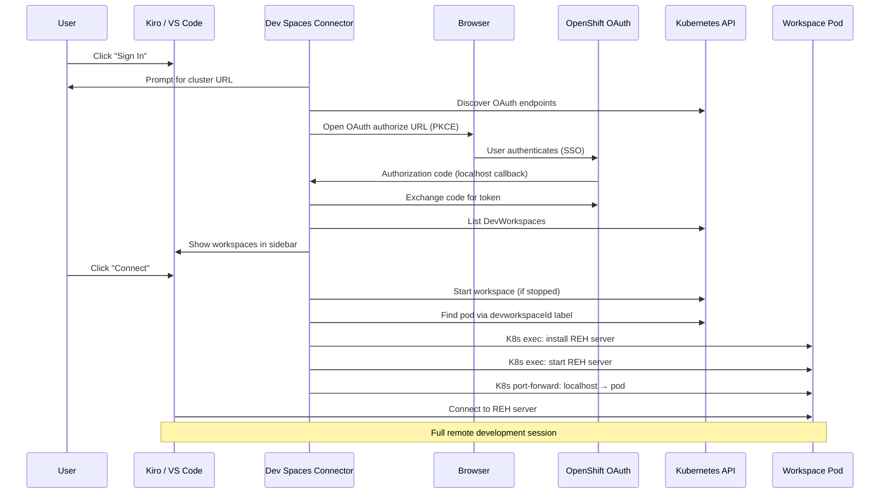
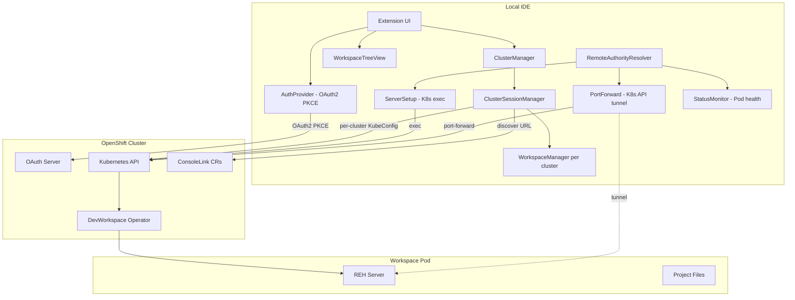
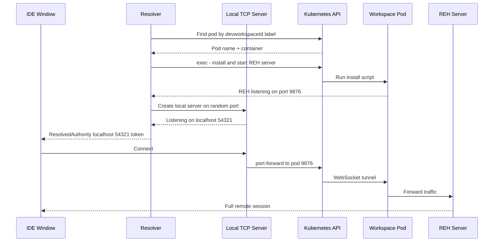
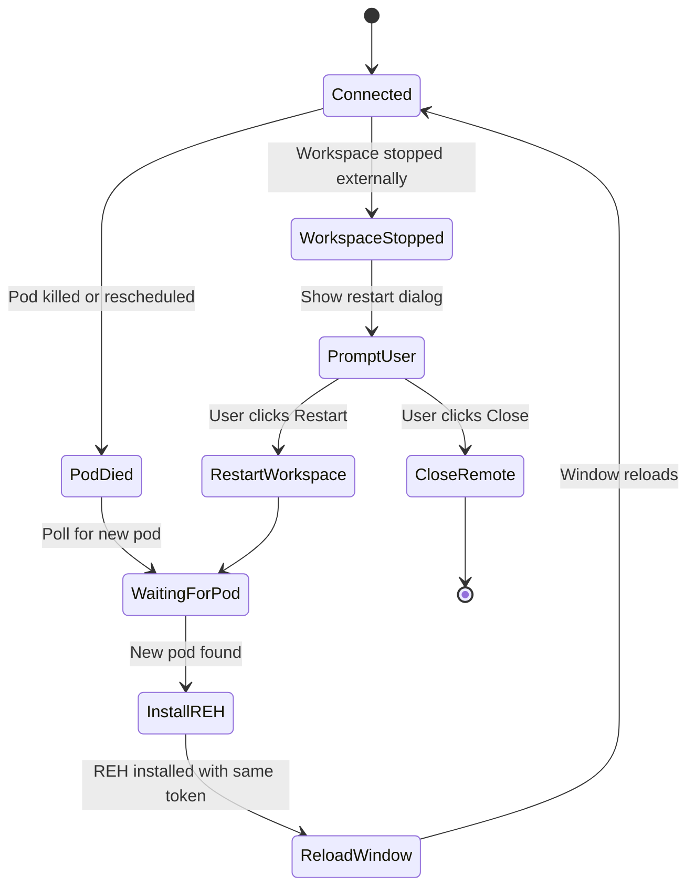

# Dev Spaces Connector

A VS Code / Kiro IDE extension that connects to [Red Hat OpenShift Dev Spaces](https://developers.redhat.com/products/openshift-dev-spaces/overview) or [Eclipse Che](https://eclipse.dev/che/) workspaces using native Kubernetes APIs. No SSH, no extra CLI tools, no configuration files.

## Features

- **One-click authentication** — Browser-based OpenShift OAuth2 with PKCE. No `oc` CLI required.
- **Workspace management** — List, start, stop, restart, create, and delete workspaces from the sidebar.
- **K8s exec transport** — Connects via Kubernetes exec + port-forward. No SSH server needed in the pod.
- **Multi-cluster** — Register and manage multiple DevSpaces clusters simultaneously.
- **Self-healing** — Automatically reconnects when pods are rescheduled or restarted. Prompts to restart stopped workspaces.
- **IDE detection** — Automatically adapts to Kiro IDE or VS Code with appropriate defaults.
- **Namespace readiness** — Waits for RBAC provisioning before allowing workspace operations on new namespaces.

## How It Works



## Architecture



### Key Design Decisions

- **`ClusterEntry`** stores `id`, `apiUrl`, `devSpacesUrl`, `appsDomain`, `displayName`. All resolved once during sign-in and persisted.
- **`WorkspaceModel`** carries a `clusterId` — every workspace knows which cluster it belongs to. No scanning required.
- **`KubeClientFactory`** is stateless — each operation builds its own `KubeConfig` from the cluster's `apiUrl` + token. No shared state between clusters.
- **`ClusterSessionManager`** manages per-cluster workspace sessions, each with its own API clients and refresh interval.
- **ConsoleLink discovery** — after auth, queries OpenShift `ConsoleLink` CRs to find the real DevSpaces URL (handles custom domains/CNAMEs).
- **Token storage** — tokens are keyed by `appsDomain` (the cluster's stable identifier), so any URL from the same cluster resolves to the same token.

## Connection Flow (Detailed)

When a user clicks **Connect** on a workspace, the following happens:

### Step 1: Prepare (local window)

1. If workspace is stopped → patch DevWorkspace CR (`spec.started: true`) → wait for `Running` phase
2. Cache the OAuth token in globalState (so the resolver can access it in the new window)
3. Store connection metadata: workspace name, namespace, devworkspaceId, cluster URL
4. Discover the project folder by reading the DevWorkspace CR's `sourceMapping` and listing `/projects/`
5. Construct the remote URI: `vscode-remote://devspaces+<workspace-name>/projects/<repo>`
6. Open a new window with that URI

### Step 2: Resolve (new window)

The new window activates the extension, which registers a `RemoteAuthorityResolver` for the `devspaces` authority:

1. **Read connection info** from globalState (workspace name, namespace, devworkspaceId, cluster URL)
2. **Build KubeConfig** from the cached OAuth token + discovered API server URL
3. **Find the pod** by label selector `controller.devfile.io/devworkspace_id=<id>` — retries for up to 2 minutes if pod is not yet ready
4. **Identify the main container** by reading the DevWorkspace CR and finding the component with `mountSources: true`

### Step 3: Install REH Server (on pod via K8s exec)

1. Detect platform (`uname -s`) and architecture (`uname -m`)
2. Check if REH is already installed for this commit — skip download if so
3. Download the REH tarball from the configured URL (resolved from `product.json` or user setting)
4. Extract to `~/.<server-data-folder>/bin/<commit>/`
5. Kill any existing server process (reads PID file)
6. Start the server: `<server-app-name> --start-server --host=127.0.0.1 --port=0 --connection-token=<uuid>`
7. Parse the server's log output to discover the randomly assigned port

### Step 4: Establish Tunnel

1. Create a **local TCP server** on `127.0.0.1:<random-port>`
2. For each incoming connection, open a **K8s port-forward** WebSocket to `pod:<REH-port>`
3. Return `ResolvedAuthority('127.0.0.1', localPort, connectionToken)` to the IDE
4. The IDE connects to the local TCP server → traffic flows through K8s API → reaches REH server in the pod

### Step 5: Monitor

- **Status monitor** polls the DevWorkspace phase every 5 seconds
- If pod name changes (rescheduled) → pre-install REH on new pod → reload window
- If workspace stopped → show restart/close dialog
- **Tunnel factory** handles application port forwarding (e.g. port 3000 in the pod to localhost:3000)



## Reconnection Flow



### How reconnection works

The extension connects to the pod via a **local TCP server** → **K8s port-forward** → **pod**. When a pod dies, the port-forward breaks. The extension handles this proactively:

1. A **status monitor** polls the DevWorkspace phase every 5 seconds
2. When the pod disappears or its name changes (rescheduled), the monitor detects it immediately
3. It waits for the DevWorkspace operator to schedule a new pod (up to 2 minutes)
4. Once the new pod is ready, it **pre-installs the REH server** using the same stable connection token from the original session
5. It then **reloads the window** — the resolver runs again, creates a fresh port-forward to the new pod, and the IDE reconnects seamlessly

This approach beats the IDE's internal reconnection timeout (~15-20s) because the extension detects pod death faster and pre-installs the server before the IDE even knows something happened. The user sees a brief window reload instead of a "Cannot reconnect" error.

## Prerequisites

- **Kiro IDE** or **VS Code 1.85+**
- Network access to your OpenShift Dev Spaces cluster
- OpenShift credentials (SSO)

### Proposed API Access

This extension uses the VS Code `resolvers` proposed API for the remote authority resolver. To run it:

**Option 1: Command-line flag**
```bash
kiro --enable-proposed-api devspaces.devspaces-connector
# or for VS Code:
code --enable-proposed-api devspaces.devspaces-connector
```

**Option 2: product.json allowlist** (for distribution)
Add the extension ID to the `extensionAllowedProposedApi` array in your IDE's `product.json`:
```json
{
  "extensionAllowedProposedApi": [
    "devspaces.devspaces-connector"
  ]
}
```

## Getting Started

1. Install the extension (VSIX or marketplace)
2. Click the **Dev Spaces** icon in the Activity Bar
3. Click **Sign In to Dev Spaces**
4. Enter your cluster URL when prompted (e.g. `https://devspaces.apps.your-cluster.example.com`)
5. Authenticate in your browser
6. Your workspaces appear — click **Connect** on any running workspace

The cluster URL is saved to settings automatically. On subsequent launches, sign-in is instant (SSO session).

### First-Time Users (Namespace Provisioning)

If you have never used Dev Spaces before, your workspace namespace won't exist yet. The extension handles this automatically:

1. After sign-in, the extension detects that no namespace is provisioned
2. You'll see a notification: *"Your Dev Spaces environment needs to be initialized"*
3. Click **Open Dashboard** — a browser tab opens briefly to trigger provisioning
4. The extension polls in the background until your namespace is ready
5. Once provisioned, you'll see *"Dev Spaces environment ready!"* and your workspaces load

This is a one-time step. After provisioning, the extension connects instantly on future sign-ins.

## Extension Settings

| Setting | Type | Default | Description |
|---|---|---|---|
| `devspaces.clusters` | `string[]` | `[]` | List of Dev Spaces cluster URLs. First entry is the default. Automatically populated when you sign in for the first time. |
| `devspaces.kiroCopyCredentials` | `boolean` | `true` | Copy Kiro IDE auth credentials to pod on connect. Only visible in Kiro IDE. |
| `devspaces.autoConnect` | `boolean` | `false` | Auto-connect to last workspace on startup. |
| `devspaces.autoOpenFolder` | `boolean` | `true` | Auto-open project folder after connecting. |
| `devspaces.rehDownloadUrl` | `string` | `""` | Custom URL template for downloading the Remote Extension Host (REH) server binary. Format: `https://your-host/path/${commit}/kiro-reh-${os}-${arch}.tar.gz`. If empty, uses the `serverDownloadUrlTemplate` from the IDE's built-in `product.json`. For VS Code (which lacks this field), the extension auto-constructs the URL from `updateUrl` in product.json. Kiro example: `https://your-mirror/releases/remotes/${commit}/kiro-reh-${os}-${arch}.tar.gz`. VS Code example: `https://your-mirror/commit:${commit}/server-${os}-${arch}/stable`. VSCodium example: `https://github.com/VSCodium/vscodium/releases/download/${version}/vscodium-reh-${os}-${arch}-${version}.tar.gz`. |
| `devspaces.connectionTimeout` | `number` | `300` | Max seconds to wait for workspace start. |
| `devspaces.reconnect.enabled` | `boolean` | `true` | Auto-reconnect on connection loss. |
| `devspaces.reconnect.maxRetries` | `number` | `5` | Max reconnection attempts. |
| `devspaces.logLevel` | `string` | `"info"` | Logging verbosity: `debug`, `info`, `warn`, `error`. |
| `devspaces.openBehavior` | `string` | `"newWindow"` | How to open remote sessions: `newWindow`, `currentWindow`, `prompt`. |
| `devspaces.hideRemoteExplorer` | `boolean` | `true` | Hide the Remote-SSH explorer sidebar. |
| `devspaces.initialization.roleBindingName` | `string` | `"devspaces-user-container-build"` | RoleBinding to wait for during namespace init. |
| `devspaces.initialization.timeout` | `number` | `120` | Max seconds to wait for namespace initialization. |
| `devspaces.initialization.pollInterval` | `number` | `2` | Poll interval (seconds) for readiness check. |
| `devspaces.initialization.namespaceAgeThreshold` | `number` | `300` | Namespace age threshold (seconds). Set to 0 to always check. |

## Commands

All commands are in the Command Palette under **Dev Spaces**:

| Command | Description |
|---|---|
| Sign In to Dev Spaces | Authenticate to your cluster |
| Sign Out | Clear stored credentials |
| Add Cluster | Register a new DevSpaces cluster |
| Remove Cluster | Remove a registered cluster |
| Clear All Authentication | Nuclear reset of all auth state |
| Refresh Workspaces | Reload workspace list |
| New Workspace | Create workspace (Git or empty) |
| Start / Stop / Restart Workspace | Lifecycle management |
| Delete Workspace | Remove with confirmation |
| Connect to Workspace | Open remote session via K8s exec |
| Disconnect | Close active connection |
| Open in Browser | Open in DevSpaces dashboard |
| Restart from Local Devfile | Apply devfile and restart (remote only) |

## Development

```bash
# Install dependencies
npm install

# Build
npm run compile

# Run tests
npm test

# Package VSIX
npm run vsix

# Run with proposed API enabled
kiro --enable-proposed-api devspaces.devspaces-connector --extensionDevelopmentPath=.
```

### Custom CA Certificates

For environments with custom/enterprise CAs, set environment variables before building:

```bash
# Download CA bundle from a URL
CA_BUNDLE_URL=https://your-pki-server/ca-bundle.pem npm run compile

# Or extract from a server's TLS chain
CA_BUNDLE_HOST=devspaces.your-cluster.example.com npm run compile
```

The extension also respects `NODE_EXTRA_CA_CERTS` at runtime and loads system CAs automatically.

## Security

- OAuth tokens stored in VS Code globalState (local SQLite) with configurable expiry
- Automatic token refresh via background SSO re-authentication
- All API communication over TLS with system CA support
- Bearer tokens redacted from log output
- Connection tokens are unique per session (UUID)
- No telemetry or analytics collected
- K8s exec sessions are ephemeral

## License

MIT
