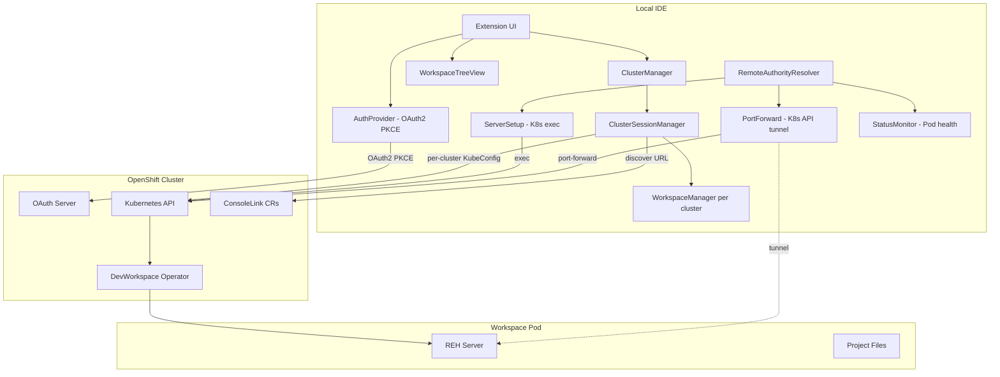
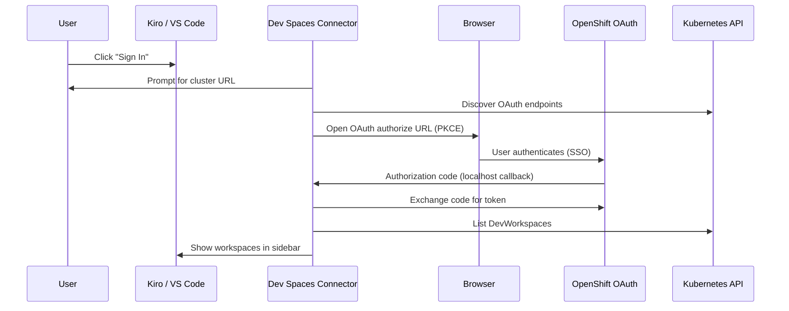
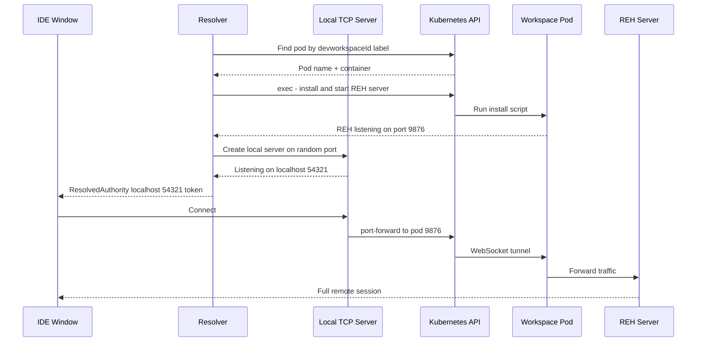
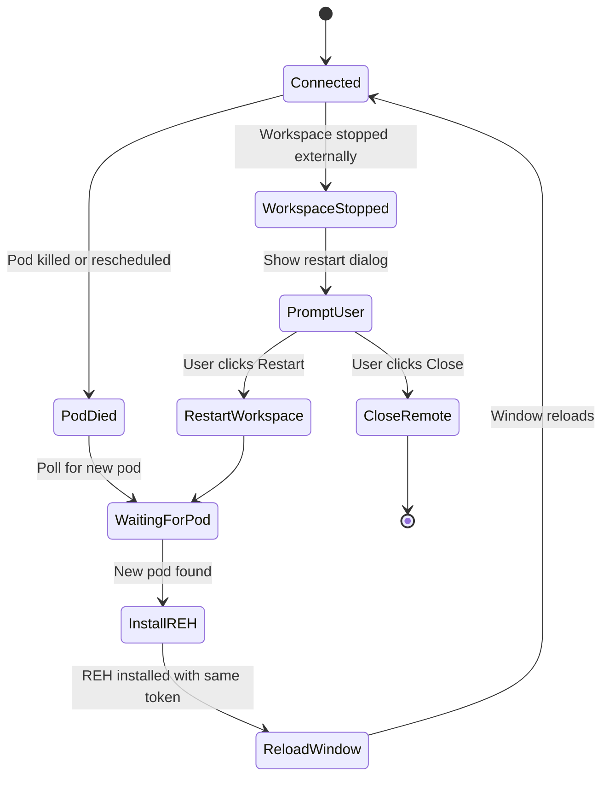

# Architecture

Technical internals of the Dev Spaces Connector extension.

## High-Level Architecture



## Key Design Decisions

- **`ClusterEntry`** stores `id`, `apiUrl`, `devSpacesUrl`, `appsDomain`, `displayName`. All resolved once during sign-in and persisted.
- **`WorkspaceModel`** carries a `clusterId` — every workspace knows which cluster it belongs to. No scanning required.
- **`KubeClientFactory`** is stateless — each operation builds its own `KubeConfig` from the cluster's `apiUrl` + token. No shared state between clusters.
- **`ClusterSessionManager`** manages per-cluster workspace sessions, each with its own API clients and refresh interval.
- **ConsoleLink discovery** — after auth, queries OpenShift `ConsoleLink` CRs to find the real DevSpaces URL (handles custom domains/CNAMEs).
- **Token storage** — tokens are keyed by `appsDomain` (the cluster's stable identifier), so any URL from the same cluster resolves to the same token.

## Authentication Flow



## Connection Flow (Detailed)

When a user clicks **Connect** on a workspace:

### Step 1: Prepare (local window)

1. If workspace is stopped → patch DevWorkspace CR (`spec.started: true`) → wait for `Running` phase
2. Cache the OAuth token in globalState (so the resolver can access it in the new window)
3. Store connection metadata: workspace name, namespace, devworkspaceId, cluster URL
4. Discover the project folder by reading the DevWorkspace CR's `sourceMapping` and listing `/projects/`
5. Construct the remote URI: `vscode-remote://devspaces+<workspace-name>/projects/<repo>`
6. Open a new window with that URI

### Step 2: Resolve (new window)

The new window activates the extension, which registers a `RemoteAuthorityResolver` for the `devspaces` authority:

1. **Read connection info** from globalState (workspace name, namespace, devworkspaceId, cluster URL)
2. **Build KubeConfig** from the cached OAuth token + discovered API server URL
3. **Find the pod** by label selector `controller.devfile.io/devworkspace_id=<id>` — retries for up to 2 minutes if pod is not yet ready
4. **Identify the main container** by reading the DevWorkspace CR and finding the component with `mountSources: true`

### Step 3: Install REH Server (on pod via K8s exec)

1. Detect platform (`uname -s`) and architecture (`uname -m`)
2. Check if REH is already installed for this commit — skip download if so
3. Download the REH tarball from the configured URL (resolved from `product.json` or user setting)
4. Extract to `~/.<server-data-folder>/bin/<commit>/`
5. Kill any existing server process (reads PID file)
6. Start the server: `<server-app-name> --start-server --host=127.0.0.1 --port=0 --connection-token=<uuid>`
7. Parse the server's log output to discover the randomly assigned port

### Step 4: Establish Tunnel

1. Create a **local TCP server** on `127.0.0.1:<random-port>`
2. For each incoming connection, open a **K8s port-forward** WebSocket to `pod:<REH-port>`
3. Return `ResolvedAuthority('127.0.0.1', localPort, connectionToken)` to the IDE
4. The IDE connects to the local TCP server → traffic flows through K8s API → reaches REH server in the pod

### Step 5: Monitor

- **Status monitor** polls the DevWorkspace phase every 5 seconds
- If pod name changes (rescheduled) → pre-install REH on new pod → reload window
- If workspace stopped → show restart/close dialog
- **Tunnel factory** handles application port forwarding (e.g. port 3000 in the pod to localhost:3000)



## Reconnection Flow



### How reconnection works

The extension connects to the pod via a **local TCP server** → **K8s port-forward** → **pod**. When a pod dies, the port-forward breaks. The extension handles this proactively:

1. A **status monitor** polls the DevWorkspace phase every 5 seconds
2. When the pod disappears or its name changes (rescheduled), the monitor detects it immediately
3. It waits for the DevWorkspace operator to schedule a new pod (up to 2 minutes)
4. Once the new pod is ready, it **pre-installs the REH server** using the same stable connection token from the original session
5. It then **reloads the window** — the resolver runs again, creates a fresh port-forward to the new pod, and the IDE reconnects seamlessly

This approach beats the IDE's internal reconnection timeout (~15-20s) because the extension detects pod death faster and pre-installs the server before the IDE even knows something happened. The user sees a brief window reload instead of a "Cannot reconnect" error.

## Component Architecture (Text Diagram)

```text
┌─────────────────────────────────────────────────────────┐
│ Kiro (Local)                                            │
│                                                         │
│  ┌─────────────────┐  ┌──────────────────────────────┐  │
│  │ ClusterManager  │  │ RemoteAuthorityResolver      │  │
│  │ (multi-cluster) │  │ (resolvers proposed API)     │  │
│  └────────┬────────┘  └──────────┬───────────────────┘  │
│           │                      │                      │
│  ┌────────▼────────┐  ┌─────────▼────────────────────┐  │
│  │ WorkspaceManager│  │ ServerSetup (K8s exec)       │  │
│  │ (per cluster)   │  │ Install + start REH server   │  │
│  └────────┬────────┘  └─────────┬────────────────────┘  │
│           │                      │                      │
│  ┌────────▼────────┐  ┌─────────▼────────────────────┐  │
│  │ DevWorkspaceApi │  │ K8s PortForward              │  │
│  │ NamespaceApi    │  │ localhost → pod:REH-port     │  │
│  │ PodDiscovery    │  └──────────────────────────────┘  │
│  └────────┬────────┘                                    │
│           │                                             │
│  ┌────────▼────────┐                                    │
│  │ OpenShift OAuth │                                    │
│  │ (PKCE + SSO)    │                                    │
│  └─────────────────┘                                    │
│                                                         │
└──────────────────────────────┬──────────────────────────┘
                               │ K8s API (exec, port-forward)
                               ▼
┌─────────────────────────────────────────────────────────┐
│ Workspace Pod                                           │
│                                                         │
│  ┌─────────────────────────────────────────────────┐    │
│  │ REH Server                                      │    │
│  │ - Listening on 127.0.0.1:<random-port>          │    │
│  │ - Connection token authentication               │    │
│  │ - Remote extension host                         │    │
│  │ - File system, terminal, IntelliSense           │    │
│  └─────────────────────────────────────────────────┘    │
│                                                         │
│  /projects/<repo>  ← project files                      │
│  ~/.aws/sso/cache/ ← credentials (synced from local)   │
│                                                         │
└─────────────────────────────────────────────────────────┘
```

## Migration History: SSH → K8s Exec

| Capability | v0.1.0 (SSH) | v0.6.0+ (K8s Exec) |
| --- | --- | --- |
| Transport | SSH via `ssh2` library | K8s exec + port-forward |
| Requires in pod | sshd + SSH keys | Nothing extra |
| Editor template | `che-code-sshd` required | Any editor works |
| User permissions | SSH user context (may differ) | Container default user (matches native) |
| Native modules | `ssh2` (platform-specific VSIX) | None (universal VSIX) |
| Port forwarding | SSH tunnels | K8s port-forward API |
| REH download | Configured via Remote-SSH setting | Direct via install script |
| Remote-SSH dependency | Required | Not needed (built-in resolver) |
| Pod restart handling | Stored pod name (stale) | Dynamic discovery + polling |
| Multi-cluster | Single cluster only | Multiple clusters simultaneously |
| Container selection | Exclude sidecars by name | DevWorkspace CR mountSources attribute |

## Security Model

- OAuth tokens stored in VS Code SecretStorage (OS keychain backed) with globalState fallback
- All API communication over TLS (K8s API, OAuth endpoints)
- Bearer tokens redacted from log output
- Connection tokens for REH server are unique per session (UUID)
- K8s exec authenticated via the same OAuth token used for workspace management
- No SSH keys written to disk
- Credentials copied to pod with 600 permissions
- No telemetry or analytics collected
